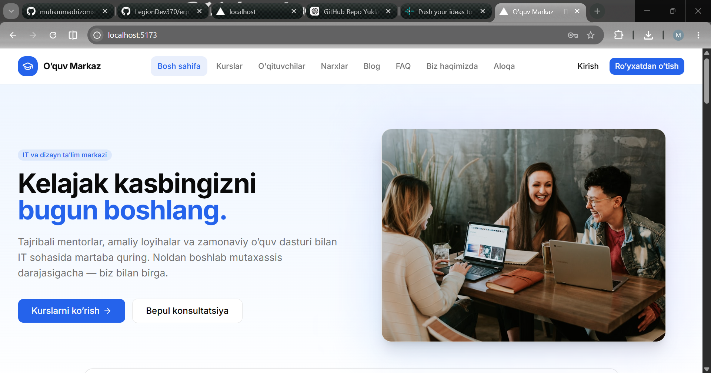
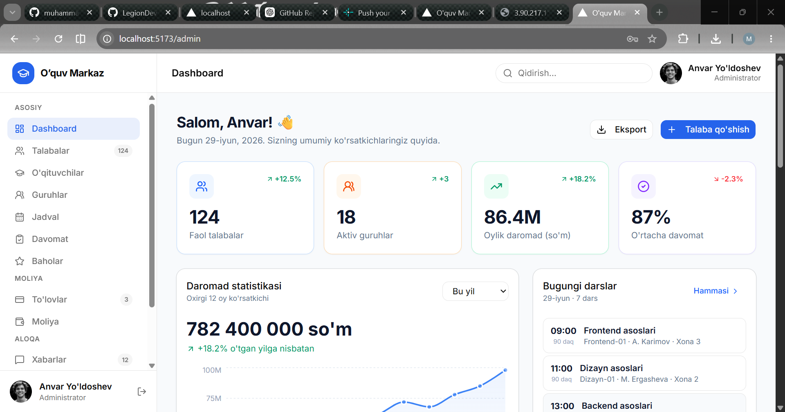
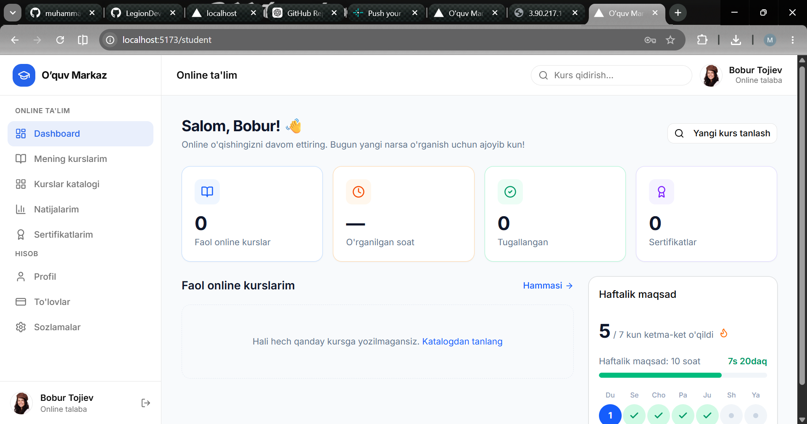
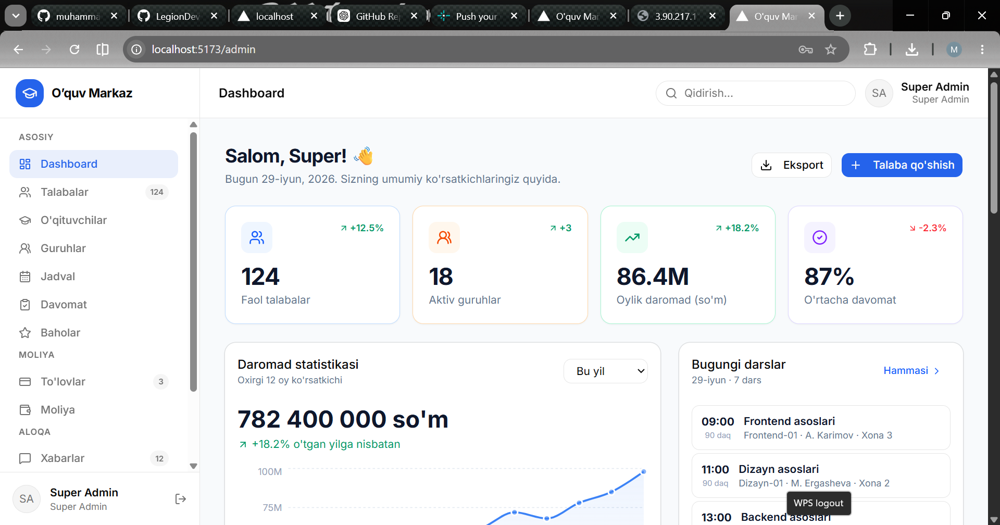

# O'quv Markaz

🌐 **Live Demo:** [evalution-core-fixed.vercel.app](https://evalution-core-fixed.vercel.app/)

Farg'onagi IT va dizayn ta'lim markazi uchun to'liq web-platforma: marketing sayti, autentifikatsiya sahifalari va admin boshqaruv paneli.

## Texnologiyalar

- **Vite + React 19**
- **TypeScript**
- **Tailwind CSS v4**
- **shadcn/ui** + lucide-react ikonkalari

## Ishga tushirish

```bash
npm install
npm run dev      # http://localhost:5173
```

Production:

```bash
npm run build
npm run start
``
`
## 📸 Screenshotlar

### Bosh sahifa


### Admin panel


### Talaba paneli


### Super admin paneli


## Sahifalar

### Sayt (public)

| Yo'l | Sahifa |
| --- | --- |
| `/` | Bosh sahifa (hero, kurslar, o'qituvchilar, fikrlar, FAQ) |
| `/kurslar` | Kurslar katalogi — ishlaydigan filtrlar bilan |
| `/kurslar/[slug]` | Kurs tafsiloti |
| `/oqituvchilar` | O'qituvchilar — qidiruv va kategoriya filtri |
| `/blog`, `/blog/[slug]` | Blog ro'yxati va maqola |
| `/aloqa` | Aloqa formasi |
| `/biz-haqimizda` | Biz haqimizda |
| `/login`, `/register` | Kirish / ro'yxatdan o'tish (jonli validatsiya) |

### Admin panel (`/admin`)

| Yo'l | Sahifa |
| --- | --- |
| `/admin` | Dashboard — statistika, bugungi darslar, to'lovlar |
| `/admin/talabalar`, `/admin/talabalar/[id]` | Talabalar ro'yxati va profili |
| `/admin/guruhlar`, `/admin/guruhlar/[id]` | Guruhlar va guruh tafsiloti |
| `/admin/guruhlar/yangi` | Yangi guruh yaratish formasi |
| `/admin/jadval` | Haftalik dars jadvali va xonalar holati |
| `/admin/davomat` | Interaktiv davomat belgilash |
| `/admin/oqituvchilar` | O'qituvchilar boshqaruvi |

## Tuzilma

```
src/
├── app/
│   ├── (site)/        # public sahifalar (header + footer layout)
│   ├── admin/         # admin panel (sidebar + topbar layout)
│   ├── login/         # auth sahifalar (AuthShell)
│   └── register/
├── components/
│   ├── site/          # public komponentlar
│   ├── admin/         # sidebar, topbar
│   ├── auth/          # AuthShell, ijtimoiy tugmalar
│   └── ui/            # shadcn/ui komponentlari
└── lib/
    └── data.ts        # mock ma'lumotlar (API o'rniga)
```

## Eslatma

Barcha ma'lumotlar `src/lib/data.ts` faylidagi mock'lardan olinadi — real backend ulashda shu modulni API chaqiriqlari bilan almashtirish kifoya. Rasmlar `images.unsplash.com` va `i.pravatar.cc` dan yuklanadi.
# erp-online_maktab
